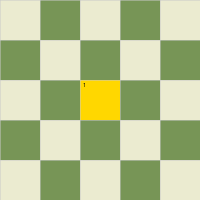
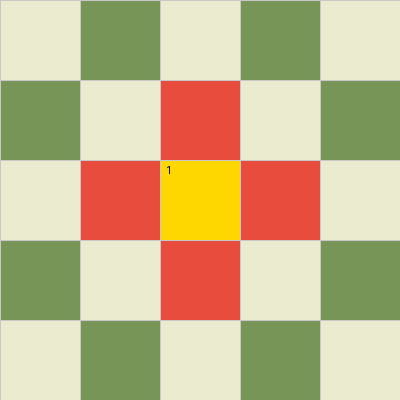
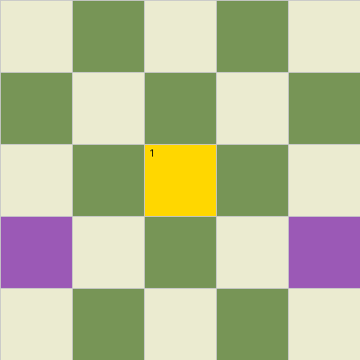

# Knight's Tour - Nhóm 9
Trò chơi áp dụng các thuật toán tìm kiếm để giải bài toán **Knight's Tour (Mã đi tuần)** theo từng cấp độ, đồng thời hỗ trợ xuất quá trình di chuyển của quân Mã thành file ảnh động (GIF).
---

## Tính năng chính
* **Giải thuật toán:** Sử dụng các thuật toán tìm kiếm để tìm đường đi tối ưu cho quân Mã qua từng level.
* **Trực quan hóa:** Giao diện trực quan màn chơi bằng `pygame`.
* **Xuất kết quả:** Tự động tạo và lưu file GIF mô phỏng đường đi của thuật toán sau khi hoàn thành.
---

## Trực quan hóa bằng ảnh GIF
### 1. Uninformed
| | | | |
| :---: | :---: | :---: | :---: |
| **BFS** | **DFS** | **UCS** | **IDS** |
|  |  |  |  |
### 2. Informed
| | | |
| :---: | :---: | :---: |
| **GBFS** | **Astar** | **IDAstar** |
|  |  |  |
### 3. Local Search
| | | | |
| :---: | :---: | :---: | :---: |
| **Simple HC** | **Stochastic HC** | **Random Restart HC** | **Local Beam** |
|  |  |  |  |
### 4. Complex Environment
| | | | |
| :---: | :---: | :---: | :---: |
| **Belief State (No Obs)** | **Belief State (Partial Obs)** | **Belief State (Full Obs)** | **AND-OR** |
| --- | --- | --- |  |
### 5. CSP
| | | | |
| :---: | :---: | :---: | :---: |
| **Backtracking** | **Forward Checking** | **AC-3** | **Min-Conflits** |
|  |  |  |  |
### 6. Adversarial
| | | |
| :---: | :---: | :---: |
| **Minimax** | **Alpha-Beta** | **Expectimax** |
|  | --- |  |
---

## Hướng dẫn cài đặt và sử dụng
### 1. Cài đặt thư viện
Trước khi chạy, bạn cần cài đặt các thư viện bổ trợ. Mở terminal tại thư mục dự án và chọn một trong hai cách sau:

* **Cách 1:** Cài đặt nhanh qua file `requirements.txt`:
    ```bash
    pip install -r requirements.txt
    ```
* **Cách 2:** Cài đặt thủ công các thư viện bắt buộc:
    ```bash
    pip install pygame
    ```
    ```bash
    pip install Pillow
    ```
### 2. Cấu hình tốc độ AI
Bạn có thể tùy chỉnh tốc độ di chuyển hoặc suy nghĩ của AI bằng cách thay đổi giá trị biến `AI_DELAY` trong file cấu hình:
* Mở file: `...\config.py`
* Chỉnh sửa dòng:
    ```python
    AI_DELAY = ...
    ```
### 3. Chạy chương trình
*   ```bash
    python main.py
    ```
---

## Kết quả đầu ra
Sau khi thuật toán tìm được đường đi thành công, file ảnh động GIF mô phỏng toàn bộ quá trình sẽ được tự động xuất và lưu trữ tại:
* Thư mục: **`exports/`**